# CVDS2-LAB05

## parte 2

3. Revise en el pom.xml para qué puerto TCP/IP está configurado el servidor embebido de Tomcat (ver sección de plugins)

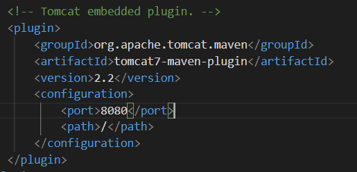

4. compile y ejecute la aplicación en el servidor embebido Tomcat, a través de Maven
    1. compilar 
    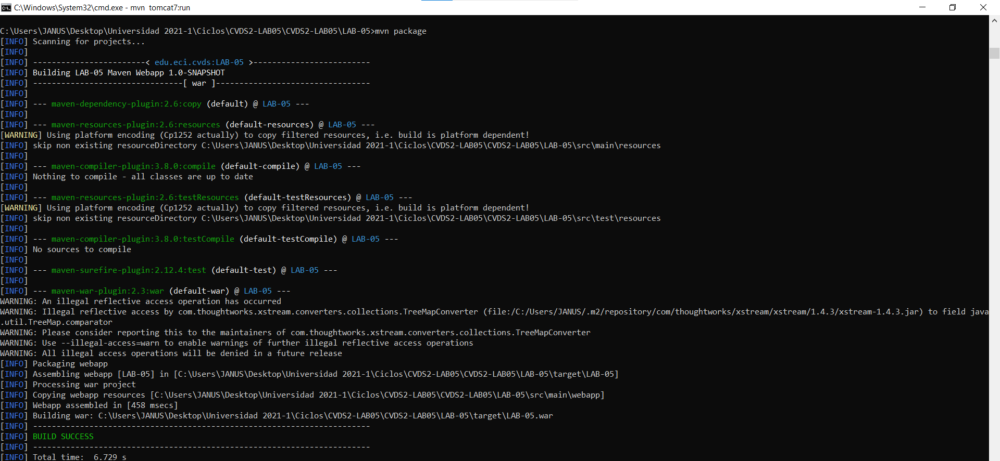
    2. ejecutar
    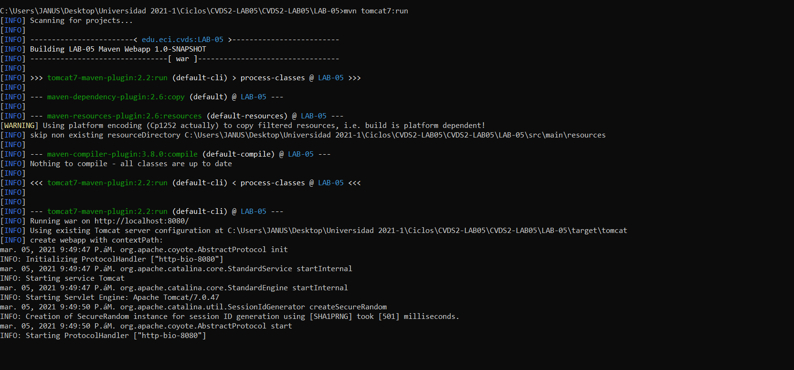

5. Abra un navegador, y en la barra de direcciones ponga la URL con la cual se le enviarán peticiones al ‘SampleServlet’. Tenga en cuenta que la URL tendrá como host ‘localhost’, como puerto, el configurado en el pom.xml y el path debe ser el del Servlet. Debería obtener un mensaje de saludo.

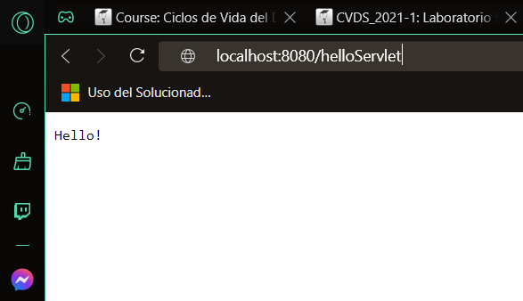

6. Observe que el Servlet ‘SampleServlet’ acepta peticiones GET, y opcionalmente, lee el parámetro ‘name’. Ingrese la misma URL, pero ahora agregando un parámetro GET (si no sabe como hacerlo, revise la documentación en http://www.w3schools.com/tags/ref_httpmethods.asp).

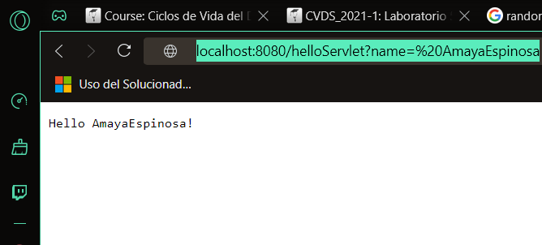

7. implementación personalizada "ServletLab" según [jsonplaceholder.typicode.com/1](https://jsonplaceholder.typicode.com/todos/1)

    1. 
    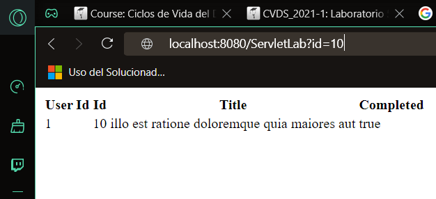
    2. 
    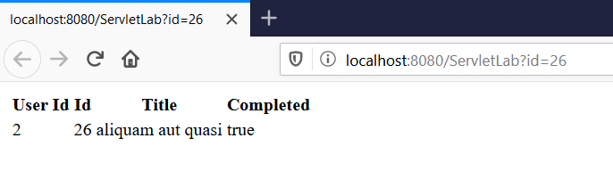

## parte 3

### ejecución de index en el navegador

1. 
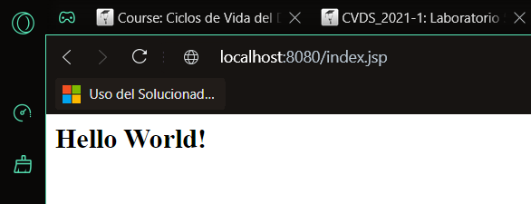
2. 
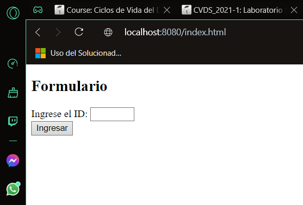
3. 
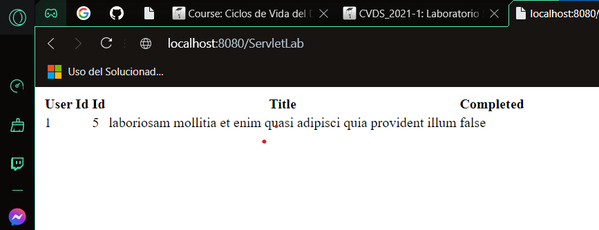

## parte 4

1. compilación y ejecución del código
    1. compilación 
    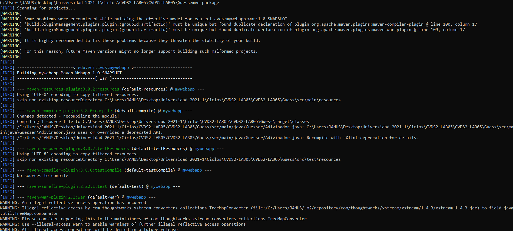
    2. ejecución
    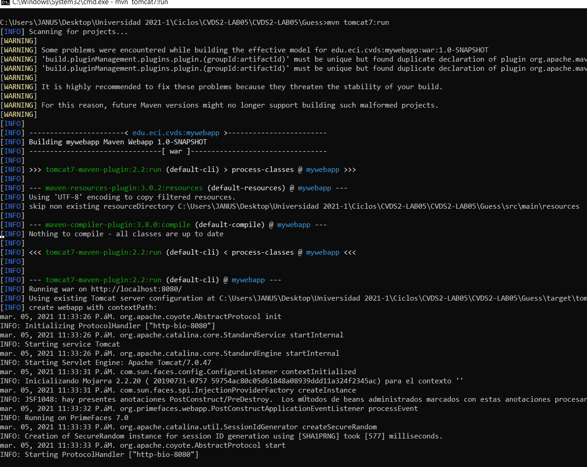

2. mywebapp: 

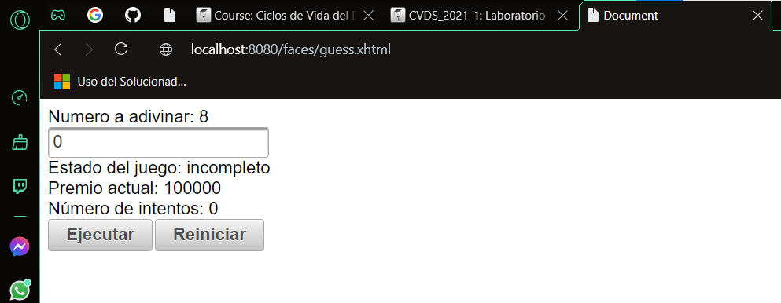
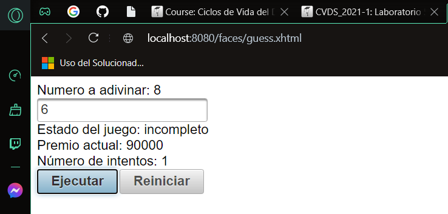
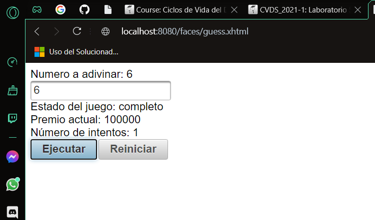

